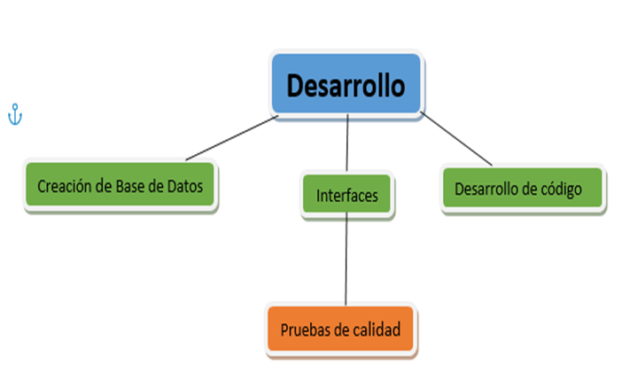
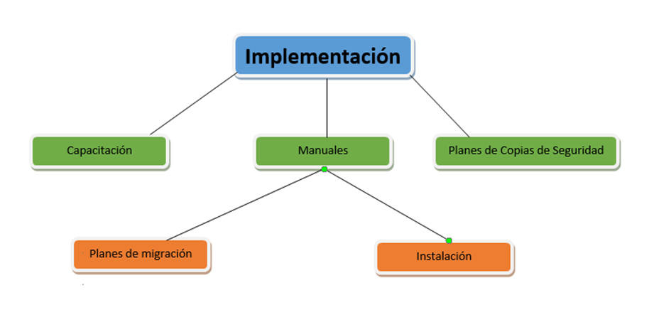
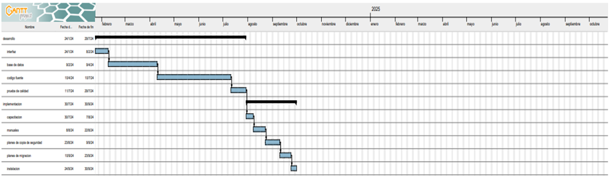

# PLAN DE TRABAJO DUC
*26/01/2024 
DEVUNITY CREW*

### HISTÓRICO DE CAMBIOS.

|Fecha|	Versión|	Descripción|	Autor|
|--|--|--|--|
|23/01/2024	|1.0	|Creación de Plan de trabajo|	Abel Mattos, Andrés Padilla, Dariana Ruiz, Luis Cortezano, Nehemías Yepes, Samuel Buzón|

### Tabla de contenido.

1. [ACTA DE PROYECTO.](#1-acta-de-proyecto)

    1.1 [Plan de la estructura del proyecto (PEP).](#11-plan-de-la-estructura-del-proyecto-pep)

    1.2 [Hitos.](#12-hitos)

    1.3 [Métodos de elaboración del PEP](#13-métodos-de-elaboración-del-pep)

2. [Estimación de la duración y costos](#2-estimación-de-la-duración-y-costos)

    2.1 [Planeación del proyecto](#21-planeación-del-proyecto)

    2.2 [Diagrama de Gantt](#22-diagrama-de-gantt)

    ### 1.	Acta de proyecto

    #### 1.1.	Plan de la estructura del proyecto (PEP)
-	**Alcance del proyecto:**
    
    -	El objetivo central de este documento es asegurar la eficiencia y el éxito el desarrollo de software mediante la estructuración de fases, paquetes de trabajo e hitos. Estos elementos permitirán una estimación precisa del tiempo necesario para completar las tareas del proyecto, maximizando así su desempeño y garantizando resultados óptimos. El plan de trabajo, en este contexto, se convierte en una herramienta esencial para la organización y el control del proyecto, lo que a su vez aumenta la probabilidad de cumplir con las expectativas del cliente y obtener un producto final exitoso.

- **Disponibilidad y capacidad de recursos:**

  - Contamos con 6 desarrolladores que cuenta con la capacidad y herramientas necesarias como el internet y computadores de la institución.
  De los cuales 4 de los desarrolladores tienen disponibilidad de computadoras propias para facilitar y/o extender el alcance del desarrollo del proyecto.

- **Calendario de fases del proyecto:**
   - **Desarrollo** – 6 Meses
   - **Implementación** – 2 Meses

  #### 1.2.	Hitos.
   **Desarrollo:**
  1. **Creación de Base de Datos – 2 Meses:**

    - Diseño e implementación de la base de datos para gestionar productos, inventario y datos de clientes.
  2. **Creación de Interfaces – 2 Semanas:**

   -	Diseño y desarrollo de interfaces de usuario intuitivas, incluyendo páginas de productos, carrito de compras y área de pago.

  3.**Desarrollo de Código Fuente – 3 Meses:**

  - Codificación de la lógica de negocio, procesamiento de pedidos y gestión de usuarios para la farmacia online.

  4.**Pruebas – 2 Semanas:**

  - Realización de pruebas exhaustivas, abarcando desde pruebas unitarias hasta pruebas de sistema, para asegurar la funcionalidad y la integridad del sistema.

  **Implementación:**
  1. **Capacitación – 1 Semana:**
     - Creación de material detallado para capacitar al personal en el uso efectivo de la plataforma, incluyendo manuales y recursos multimedia.

  2. **Manuales – 2 Semanas:**
     - Elaboración de manuales exhaustivos para usuarios y administradores, proporcionando instrucciones claras sobre todas las funciones y procedimientos relevantes.

  3. **Planes de Copias de Seguridad – 2 Semanas:**

     - Diseño de un plan sólido para realizar copias de seguridad regulares de la base de datos y otros datos críticos, garantizando la integridad y la recuperación en caso de fallo.

4.	**Planes de Migración – 2 Semanas:**

    - Creación de un plan detallado para la migración de datos, aplicaciones y configuraciones en caso de actualizaciones del sistema.

5.	**Instalación – 1 Semana:**
    -	Implementación del proceso de instalación del sistema, asegurando una configuración correcta y la compatibilidad con los entornos de producción.

#### 1.3.	Métodos de elaboración del PEP

**Bottom Up:**

En programación, el enfoque “Bottom Up” implica construir un sistema o programa comenzando desde componentes más pequeños o funciones básicas, y luego integrarlos para formar una solución completa. Esto permite una modularidad y reutilización eficiente del código, ya que cada componente se desarrolla y prueba de manera independiente antes de la integración. Este método facilita la identificación y corrección de errores a medida que se avanza en el 

### 2.	Estimación de la duración y costos.
**Desarrollo:**
1.	**Creación de BD – 2 Meses:**

 - Duración: 2 Meses
 -	Costos: No hay gastos de recursos monetarios ya que el Gestor de base de Datos que usamos es gratuito (Si desea cambiar el Gestor de Base de Datos más seguro, correrá por parte del cliente).

2.	**Interfaces – 2 semanas:**

 -	Duración: 2 Semanas
 -	Costos: No contamos con recursos monetarios ya que al ser un proyecto formativo el Sena nos brinda los recursos necesarios.

3.	**Desarrollo de Código Fuente – 3 Meses:**
 - 	Duración: 3 Meses
 -	Costos: No contamos con recursos monetarios ya que al ser un proyecto formativo el Sena nos brinda los recursos necesarios.

4.	**Pruebas de Calidad – 2 Semanas:**
 -	Duración: 2 Semanas
 -	Costos: No contamos con recursos monetarios ya que al ser un proyecto formativo el Sena nos brinda los recursos necesarios.

**Implementación:**

5.	**Capacitación – 1 Semana:**

 -	Duración: 1 Semana
 -	Costos: No contamos con recursos monetarios ya que al ser un proyecto formativo el Sena nos brinda los recursos necesarios.

6.	**Manuales – 2 Semanas:**
 -	Duración: 2 Semanas
 -	Costos: No contamos con recursos monetarios ya que al ser un proyecto formativo el Sena nos brinda los recursos necesarios.

7.	**Planes de Copias de Seguridad – 2 Semanas:**
 -	Duración: 2 Semanas
 -	Costos: No contamos con recursos monetarios ya que al ser un proyecto formativo el Sena nos brinda los recursos necesarios.

8.	**Planes de Migración – 2 Semanas:**
 -	Duración: 2 Semanas
 -	Costos: No contamos con recursos monetarios ya que al ser un proyecto formativo el Sena nos brinda los recursos necesarios.

9.	**Instalación – 1 Semana:**
 -	Duración: 1 Semana
 -	Costos: El costo de la instalación correrá por cuenta del cliente.

 #### 2.1.	Planeación del proyecto.
 1.	**Inicio del proyecto:**

 -	Reunión inicial para establecer objetivos y alcance del proyecto.
 -	Asignación de roles y responsabilidades del equipo.

2.	**Desarrollo de Creación de Base de Datos:**
 -	**Duración: 2 Meses**
 -	**Actividades:** 
    -	Diseño y modelado de la Base de Datos.
    -	Implementación de la Base de Datos.
    -	Pruebas unitarias de la funcionalidad de la Base de Datos.

3.	**Desarrollo de Creación de Interfaces:**
 -	**Duración: 2 Semanas**
 -	**Actividades:**
    -	Diseño y desarrollo de interfaces de usuario.
    -	Integración de interfaces con el código fuente.
    -	Pruebas de integración de interfaces.

4.	**Desarrollo de Código Fuente:**
 -	**Duración: 3 Meses**
 -	**Actividades:** 
 -	Codificación de la lógica de negocio.
    -	Desarrollo del procesamiento de pedidos.
    -	Pruebas unitarias del código fuente.

5.	**Desarrollo de Pruebas de calidad:**
-	**Duración: 2 Semanas**
-	**Actividades:**
    -	Pruebas exhaustivas de la funcionalidad del sistema.
    -	Identificación y resolución de problemas.
    -	Aprobación de las pruebas por parte del equipo.

6.	**Capacitación:**
 -	**Duración: 1 Semana**
 -	**Actividades:**
    -	Desarrollo de material de capacitación.
    -	Realización de sesiones de capacitación.

7.	**Creación de Manuales:**
 -	**Duración: 2 Semanas**
 -	**Actividades:**
    -	Elaboración de manuales detallados para usuarios y administradores.

8.	**Desarrollo de Planes de Copia de Seguridad:** 
 -	**Duración: 2 Semanas**
 -	**Actividades:** 
    -	Desarrollo de un plan detallado de copias de seguridad.
    -	Implementación y prueba del plan de copias de seguridad.

9.	**Desarrollo de Migración:**
 -	**Duración: 2 Semanas**
 -	**Actividades:**
    -	Desarrollo de un plan de migración detallado.
    -	Pruebas exhaustivas de migración.

10.	 **Instalación del software:**
 -	**Duración: 1 Semana**
 -	**Actividades:**
    -	Configuración e instalación del sistema.
    -	Verificación de la compatibilidad y funcionalidad en entornos de producción.

11.	**Cierre del Proyecto:**
-	Evaluación final del proyecto.
-	Entrega de documentación completa.
-	Celebración de logros y lecciones aprendidas.

#### 2.2.	Diagrama de Gantt.

