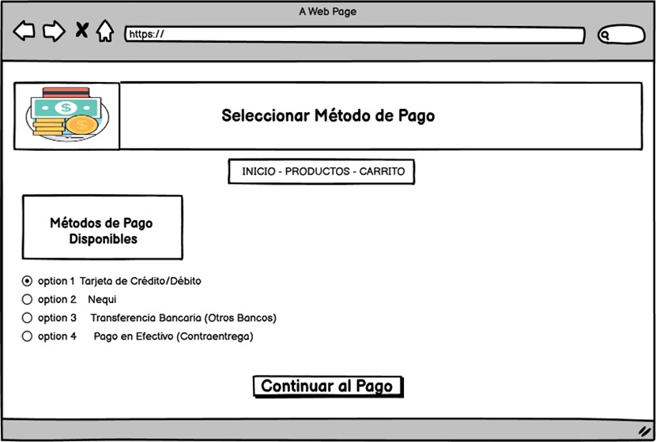

# INFORME DEL DISEÑO.

### Historial de revisiones

| Fecha      | Version | Descripción/cambio    | Autor                                                                                     |
| ---------- | ------- | --------------------- | ----------------------------------------------------------------------------------------- |
| 12/12/2023 | 1.0     | Creación de documento | Dariana Ruiz, Luis Cortezano, Andrés Padilla, Nehemías Yepes, Samuel Buzón, Abel Martínez |

## 1. Propósito

El objetivo central es detallar, a través de diagramas, el funcionamiento y los requisitos del software, así como identificar a los actores que participarán en el sistema y especificar las funciones que desempeñarán. Este enfoque permite una comprensión clara de la estructura y las interacciones dentro del proyecto.

Además, hemos enriquecido el documento al incorporar diagramas y prototipos de interfaz, proporcionando una representación visual que complementa la descripción detallada. Estos elementos visuales ofrecen una visión más intuitiva y concreta del diseño propuesto, contribuyendo a una comprensión más completa y efectiva del proyecto en su conjunto.

## Alcance

El propósito central de este documento radica en la integración de información clave y la incorporación de prototipos de interfaces en el marco de nuestro proyecto farmacéutico. Se busca, por fin, establecer un enfoque exhaustivo para la administración efectiva de datos pertinentes y, simultáneamente, para la conceptualización visual de interfaces que constituirán la estructura fundamental de nuestro sistema en el ámbito farmacéutico. Con especial énfasis en la expansión de su contenido, se pretende abordar de manera detallada tanto la recopilación como la organización de información crítica, incorporando, además, prototipos que reflejan de manera precisa y funcional la interacción prevista en el entorno farmacéutico. Este enfoque integral se concibe con el objetivo de optimizar la eficacia y la coherencia del diseño, asegurando así una implementación exitosa y eficiente de nuestro proyecto, ahora enriquecido con la inclusión estratégica de prototipos de interfaces.

## 3. Definiciones, Acrónimos, y Abreviaturas

**Diseño de software:** es el proceso por el que un agente crea una especificación de un artefacto de software, pensado para cumplir unos objetivos, utilizando un conjunto de componentes primitivos y sujeto a restricciones.

**Diseño de hardware:** Planifica, gestiona y diseña modificaciones y mantenimiento de producto de la parte Hardware. Asegura la funcionalidad, calidad y vigencia de los productos desarrollados Diseña, calcula y define las especificaciones de los componentes del producto a modificar.

**PQRS:** petición, queja, reclamo, sugerencia.

**MER:** El modelo entidad relación ER es un modelo de datos que permite representar cualquier abstracción, percepción y conocimiento en un sistema de información formado por un conjunto de objetos denominados entidades y relaciones incorporando una representación visual conocida como diagrama entidad-relación.

### Personal.

| **Nombre**     | **Correo**                         | **Telefono** |
| -------------- | ---------------------------------- | ------------ |
| Dariana Ruiz   | darianaruizmontes@gmail.com        | 3024486683   |
| Luis Cortezano | luisdavidcortezano@gmail.com       | 3246794400   |
| Andrés Padilla | Andrespadillat27@gmail.com         | 3127268142   |
| Samuel Buzón   | buzonsamuel18@gmail.com            | 3003191165   |
| Nehemías Yepes | nyeres02102006@gmail.com           | 3160412212   |
| Abel Martínez  | Martinezmattosabeljesus5@gmail.com | 3243316646   |

### 4. Situación Actual.

La farmacia actualmente lleva desde la gestión del inventario hasta la atención al cliente y el seguimiento de ventas de manera manual. Esta falta de un sistema en línea genera dificultades para administrar sus operaciones y, como resultado, experimentar una disminución en la eficiencia y la eficacia. Además, enfrenta problemas para satisfacer las expectativas de los clientes que buscan y rapidez en el proceso de compra de medicamentos. La falta de un sistema en línea dificulta ofrecer servicios adicionales y adaptarse a las tendencias del mercado digital, lo que puede afectar su competitividad en comparación con otras farmacias en línea.

### 5. Perpectiva del Producto

Este proyecto tiene como objetivo potenciar las ventas de la farmacia mediante la implementación de un sistema que facilite la experiencia de compra para los usuarios. Se espera que esta plataforma proporcione comodidad al cliente al permitir la adquisición de productos y acceso a información relevante de manera eficiente. Además, se busca ampliar la base de clientes para alcanzar a un público más extenso. La iniciativa también persigue el ahorro de tiempo para los usuarios, ya que no será necesario desplazarse esencialmente a la farmacia, promoviendo así la conveniencia en el proceso de compra.

### 6. Funciones del Producto

- gestión de usuarios.

- inicio de sesión.

- búsqueda de producto.

- Carrito de compras.

- pago para compras en línea.

- Generar factura electrónica de las compras que se realizan.

- PQRS.

- publicidad.

### 7. Características de Usuario

El sistema cuenta con tres tipos de usuario
Empleado: se encargará de la administración del sistema.
Cliente: realizara compras y consultas
Administrador: se asegura del correcto funcionamiento y gestión de la plataforma.

| **Codigo** | **Descripcion**         |
| ---------- | ----------------------- |
| RF-001     | Registro de usuario     |
| RF-002     | Inicio de sesión        |
| RF-003     | Búsqueda de productos   |
| RF-004     | Carrito de compras      |
| RF-005     | Pago de compra en línea |
| RF-006     | Factura electrónica     |
| RF-007     | PQR                     |
| RF-008     | Publicidad              |

### 9. Diseño Arq. Hardware

### 10. Diseño Arq. Software

### 11. Modelo Relacional

### 12. Prototipos

- Login

- Home

- Gestion de productos

- Registro de Usuarios

- Gestion PQR

- Gestion de carro de compras

- Metodos de pago.

- Detalle de Compra.

- Menu de Administrador

- Menu de empleado

- Gestion de pedidos

### 13. Conclusion

El informe de diseño es fundamental para comprender a fondo los avances en el proyecto, su estructura y la forma en que el usuario se conectará a él. Proporciona una visión de cómo será visualmente el proyecto, la interacción del usuario, la perspectiva del administrador y las funciones que cumplirá.
